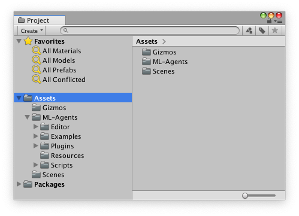
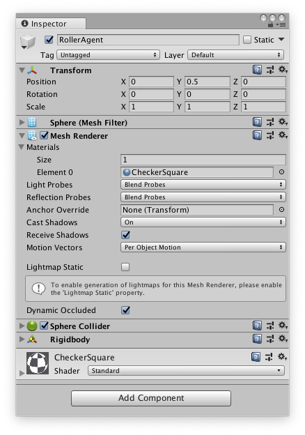
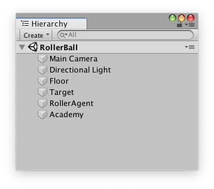
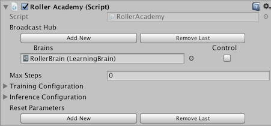
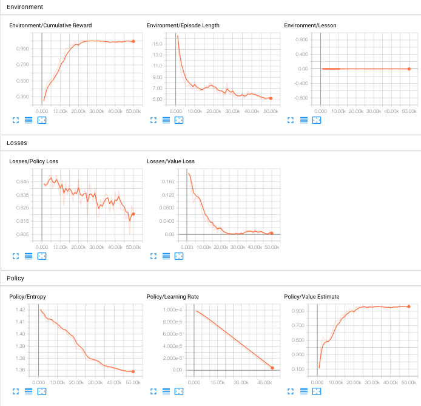

# Making a New Learning Environment

This tutorial walks through the process of creating a Unity Environment. A Unity
Environment is an application built using the Unity Engine which can be used to
train Reinforcement Learning Agents.


In this example, we will train a ball to roll to a randomly placed cube. The
ball also learns to avoid falling off the platform.

## Overview

Using the ML-Agents toolkit in a Unity project involves the following basic
steps:

1. Create an environment for your agents to live in. An environment can range
    from a simple physical simulation containing a few objects to an entire game
    or ecosystem.
2. Implement an Academy subclass and add it to a GameObject in the Unity scene
    containing the environment. Your Academy class can implement a few optional
    methods to update the scene independently of any agents. For example, you can
    add, move, or delete agents and other entities in the environment.
3. Create one or more Brain assets by clicking **Assets** > **Create** > 
    **ML-Agents** > **Brain**, and naming them appropriately.
4. Implement your Agent subclasses. An Agent subclass defines the code an Agent
    uses to observe its environment, to carry out assigned actions, and to
    calculate the rewards used for reinforcement training. You can also implement
    optional methods to reset the Agent when it has finished or failed its task.
5. Add your Agent subclasses to appropriate GameObjects, typically, the object
    in the scene that represents the Agent in the simulation. Each Agent object
    must be assigned a Brain object.
6. If training, check the `Control` checkbox in the BroadcastHub of the Academy.
    [run the training process](Training-ML-Agents.md).

**Note:** If you are unfamiliar with Unity, refer to
[Learning the interface](https://docs.unity3d.com/Manual/LearningtheInterface.html)
in the Unity Manual if an Editor task isn't explained sufficiently in this
tutorial.

If you haven't already, follow the [installation instructions](Installation.md).

## Set Up the Unity Project

The first task to accomplish is simply creating a new Unity project and
importing the ML-Agents assets into it:

1. Launch the Unity Editor and create a new project named "RollerBall".
2. Make sure that the Scripting Runtime Version for the project is set to use 
    **.NET 4.x Equivalent** (This is an experimental option in Unity 2017, 
    but is the default as of 2018.3.)
3. In a file system window, navigate to the folder containing your cloned
    ML-Agents repository.
4. Drag the `ML-Agents` folder from `UnitySDK/Assets` to the Unity Editor
    Project window.

Your Unity **Project** window should contain the following assets:



## Create the Environment

Next, we will create a very simple scene to act as our ML-Agents environment.
The "physical" components of the environment include a Plane to act as the floor
for the Agent to move around on, a Cube to act as the goal or target for the
agent to seek, and a Sphere to represent the Agent itself.

### Create the floor plane

1. Right click in Hierarchy window, select 3D Object > Plane.
2. Name the GameObject "Floor."
3. Select Plane to view its properties in the Inspector window.
4. Set Transform to Position = (0,0,0), Rotation = (0,0,0), Scale = (1,1,1).
5. On the Plane's Mesh Renderer, expand the Materials property and change the
    default-material to *LightGridFloorSquare* (or any suitable material of your choice).

(To set a new material, click the small circle icon next to the current material
name. This opens the **Object Picker** dialog so that you can choose a
different material from the list of all materials currently in the project.)


### Add the Target Cube

1. Right click in Hierarchy window, select 3D Object > Cube.
2. Name the GameObject "Target"
3. Select Target to view its properties in the Inspector window.
4. Set Transform to Position = (3,0.5,3), Rotation = (0,0,0), Scale = (1,1,1).
5. On the Cube's Mesh Renderer, expand the Materials property and change the
    default-material to *Block*.


### Add the Agent Sphere

1. Right click in Hierarchy window, select 3D Object > Sphere.
2. Name the GameObject "RollerAgent"
3. Select Target to view its properties in the Inspector window.
4. Set Transform to Position = (0,0.5,0), Rotation = (0,0,0), Scale = (1,1,1).
5. On the Sphere's Mesh Renderer, expand the Materials property and change the
    default-material to *CheckerSquare*.
6. Click **Add Component**.
7. Add the Physics/Rigidbody component to the Sphere.



Note that we will create an Agent subclass to add to this GameObject as a
component later in the tutorial.

### Add an Empty GameObject to Hold the Academy

1. Right click in Hierarchy window, select Create Empty.
2. Name the GameObject "Academy"



You can adjust the camera angles to give a better view of the scene at runtime.
The next steps will be to create and add the ML-Agent components.

## Implement an Academy

The Academy object coordinates the ML-Agents in the scene and drives the
decision-making portion of the simulation loop. Every ML-Agent scene needs one
Academy instance. Since the base Academy class is abstract, you must make your
own subclass even if you don't need to use any of the methods for a particular
environment.

First, add a New Script component to the Academy GameObject created earlier:

1. Select the Academy GameObject to view it in the Inspector window.
2. Click **Add Component**.
3. Click **New Script** in the list of components (at the bottom).
4. Name the script "RollerAcademy".
5. Click **Create and Add**.

Next, edit the new `RollerAcademy` script:

1. In the Unity Project window, double-click the `RollerAcademy` script to open
    it in your code editor. (By default new scripts are placed directly in the
    **Assets** folder.)
2. In the code editor, add the statement, `using MLAgents;`. 
3. Change the base class from `MonoBehaviour` to `Academy`.
4. Delete the `Start()` and `Update()` methods that were added by default.

In such a basic scene, we don't need the Academy to initialize, reset, or
otherwise control any objects in the environment so we have the simplest
possible Academy implementation:

```csharp
using MLAgents;

public class RollerAcademy : Academy { }
```

The default settings for the Academy properties are also fine for this
environment, so we don't need to change anything for the RollerAcademy component
in the Inspector window.



## Add Brain Assets

The Brain object encapsulates the decision making process. An Agent sends its
observations to its Brain and expects a decision in return. The type of the Brain
(Learning, Heuristic or player) determines how the Brain makes decisions. 
To create the Brain:

1. Go to **Assets** > **Create** > **ML-Agents** and select the type of Brain asset
    you want to create. For this tutorial, create a **Learning Brain** and 
    a **Player Brain**.
2. Name them `RollerBallBrain` and `RollerBallPlayer` respectively.


We will come back to the Brain properties later, but leave the Model property
of the `RollerBallBrain` as `None` for now. We will need to first train a 
model before we can add it to the **Learning Brain**.

## Implement an Agent

To create the Agent:

1. Select the RollerAgent GameObject to view it in the Inspector window.
2. Click **Add Component**.
3. Click **New Script** in the list of components (at the bottom).
4. Name the script "RollerAgent".
5. Click **Create and Add**.

Then, edit the new `RollerAgent` script:

1. In the Unity Project window, double-click the `RollerAgent` script to open it
   in your code editor.
2. In the editor, add the `using MLAgents;` statement and then change the base 
    class from `MonoBehaviour` to `Agent`.
3. Delete the `Update()` method, but we will use the `Start()` function, so
    leave it alone for now.

So far, these are the basic steps that you would use to add ML-Agents to any
Unity project. Next, we will add the logic that will let our Agent learn to roll
to the cube using reinforcement learning.

In this simple scenario, we don't use the Academy object to control the
environment. If we wanted to change the environment, for example change the size
of the floor or add or remove agents or other objects before or during the
simulation, we could implement the appropriate methods in the Academy. Instead,
we will have the Agent do all the work of resetting itself and the target when
it succeeds or falls trying.

### Initialization and Resetting the Agent

When the Agent reaches its target, it marks itself done and its Agent reset
function moves the target to a random location. In addition, if the Agent rolls
off the platform, the reset function puts it back onto the floor.

To move the target GameObject, we need a reference to its Transform (which
stores a GameObject's position, orientation and scale in the 3D world). To get
this reference, add a public field of type `Transform` to the RollerAgent class.
Public fields of a component in Unity get displayed in the Inspector window,
allowing you to choose which GameObject to use as the target in the Unity
Editor. 

To reset the Agent's velocity (and later to apply force to move the
agent) we need a reference to the Rigidbody component. A
[Rigidbody](https://docs.unity3d.com/ScriptReference/Rigidbody.html) is Unity's
primary element for physics simulation. (See
[Physics](https://docs.unity3d.com/Manual/PhysicsSection.html) for full
documentation of Unity physics.) Since the Rigidbody component is on the same
GameObject as our Agent script, the best way to get this reference is using
`GameObject.GetComponent<T>()`, which we can call in our script's `Start()`
method.

So far, our RollerAgent script looks like:

```csharp
using System.Collections.Generic;
using UnityEngine;
using MLAgents;

public class RollerAgent : Agent
{
    Rigidbody rBody;
    void Start () {
        rBody = GetComponent<Rigidbody>();
    }

    public Transform Target;
    public override void AgentReset()
    {
        if (this.transform.position.y < 0)
        {
            // If the Agent fell, zero its momentum
            this.rBody.angularVelocity = Vector3.zero;
            this.rBody.velocity = Vector3.zero;
            this.transform.position = new Vector3( 0, 0.5f, 0);
        }

        // Move the target to a new spot
        Target.position = new Vector3(Random.value * 8 - 4,
                                      0.5f,
                                      Random.value * 8 - 4);
    }
}
```

Next, let's implement the `Agent.CollectObservations()` method.

### Observing the Environment

The Agent sends the information we collect to the Brain, which uses it to make a
decision. When you train the Agent (or use a trained model), the data is fed
into a neural network as a feature vector. For an Agent to successfully learn a
task, we need to provide the correct information. A good rule of thumb for
deciding what information to collect is to consider what you would need to
calculate an analytical solution to the problem.

In our case, the information our Agent collects includes:

* Position of the target. 

```csharp
AddVectorObs(Target.position);
```

* Position of the Agent itself. 

```csharp
AddVectorObs(this.transform.position);
```

* The velocity of the Agent. This helps the Agent learn to control its speed so
    it doesn't overshoot the target and roll off the platform.

```csharp
// Agent velocity
AddVectorObs(rBody.velocity.x);
AddVectorObs(rBody.velocity.z);
```

In total, the state observation contains 8 values and we need to use the
continuous state space when we get around to setting the Brain properties:

```csharp
public override void CollectObservations()
{
    // Target and Agent positions
    AddVectorObs(Target.position);
    AddVectorObs(this.transform.position);

    // Agent velocity
    AddVectorObs(rBody.velocity.x);
    AddVectorObs(rBody.velocity.z);
}
```

The final part of the Agent code is the `Agent.AgentAction()` method, which
receives the decision from the Brain and assigns the reward.

### Actions

The decision of the Brain comes in the form of an action array passed to the
`AgentAction()` function. The number of elements in this array is determined by
the `Vector Action` `Space Type` and `Space Size` settings of the
agent's Brain. The RollerAgent uses the continuous vector action space and needs
two continuous control signals from the Brain. Thus, we will set the Brain
`Space Size` to 2. The first element,`action[0]` determines the force
applied along the x axis; `action[1]` determines the force applied along the z
axis. (If we allowed the Agent to move in three dimensions, then we would need
to set `Vector Action Size` to 3.) Note that the Brain really has no idea what the values in
the action array mean. The training process just adjusts the action values in
response to the observation input and then sees what kind of rewards it gets as
a result.

The RollerAgent applies the values from the `action[]` array to its Rigidbody
component, `rBody`, using the `Rigidbody.AddForce` function:

```csharp
Vector3 controlSignal = Vector3.zero;
controlSignal.x = action[0];
controlSignal.z = action[1];
rBody.AddForce(controlSignal * speed);
```

### Rewards

Reinforcement learning requires rewards. Assign rewards in the `AgentAction()`
function. The learning algorithm uses the rewards assigned to the Agent during 
the simulation and learning process to determine whether it is giving
the Agent the optimal actions. You want to reward an Agent for completing the
assigned task. In this case, the Agent is given a reward of 1.0 for reaching the 
Target cube.

The RollerAgent calculates the distance to detect when it reaches the target.
When it does, the code increments the Agent.reward variable by 1.0 and marks the
agent as finished by setting the Agent to done.

```csharp
float distanceToTarget = Vector3.Distance(this.transform.position,
                                          Target.position);
// Reached target
if (distanceToTarget < 1.42f)
{
    SetReward(1.0f);
    Done();
}
```

**Note:** When you mark an Agent as done, it stops its activity until it is
reset. You can have the Agent reset immediately, by setting the
Agent.ResetOnDone property to true in the inspector or you can wait for the
Academy to reset the environment. This RollerBall environment relies on the
`ResetOnDone` mechanism and doesn't set a `Max Steps` limit for the Academy (so
it never resets the environment).

Finally, if the Agent falls off the platform,  set the Agent to done so that it can resets itself:

```csharp
// Fell off platform
if (this.transform.position.y < 0)
{
    Done();
}
```

### AgentAction()

With the action and reward logic outlined above, the final version of the
`AgentAction()` function looks like:

```csharp
public float speed = 10;
public override void AgentAction(float[] vectorAction, string textAction)
{
    // Actions, size = 2
    Vector3 controlSignal = Vector3.zero;
    controlSignal.x = vectorAction[0];
    controlSignal.z = vectorAction[1];
    rBody.AddForce(controlSignal * speed);

    // Rewards
    float distanceToTarget = Vector3.Distance(this.transform.position,
                                              Target.position);

    // Reached target
    if (distanceToTarget < 1.42f)
    {
        SetReward(1.0f);
        Done();
    }

    // Fell off platform
    if (this.transform.position.y < 0)
    {
        Done();
    }

}
```

Note the `speed` class variable defined before the
function. Since `speed` is public, you can set the value from the Inspector
window.

## Final Editor Setup

Now, that all the GameObjects and ML-Agent components are in place, it is time
to connect everything together in the Unity Editor. This involves assigning the
Brain asset to the Agent, changing some of the Agent Components properties, and
setting the Brain properties so that they are compatible with our Agent code.

1. In the Academy Inspector, add the `RollerBallBrain` and `RollerBallPlayer`
    Brains to the **Broadcast Hub**.
2. Select the **RollerAgent** GameObject to show its properties in the Inspector
    window.
3. Drag the Brain **RollerBallPlayer** from the Project window to the 
    RollerAgent **Brain** field.
4. Change **Decision Frequency** from `1` to `10`.


Also, drag the Target GameObject from the Hierarchy window to the RollerAgent
Target field.

Finally, select the RollerBallBrain Asset in the **Project** window so that you can 
see its properties in the Inspector window. Set the following properties:

* `Vector Observation` `Space Size` = 8
* `Vector Action` `Space Type` = **Continuous**
* `Vector Action` `Space Size` = 2

Select the **RollerBallPlayer** Asset in the **Project** window and set the same
property values.

Now you are ready to test the environment before training.

## Testing the Environment

It is always a good idea to test your environment manually before embarking on
an extended training run. The reason we have created the `RollerBallPlayer` Brain
is so that we can control the Agent using direct keyboard
control. But first, you need to define the keyboard to action mapping. Although
the RollerAgent only has an `Action Size` of two, we will use one key to specify
positive values and one to specify negative values for each action, for a total
of four keys.

1. Select the `RollerBallPlayer` Aset to view its properties in the Inspector.
2. Expand the **Key Continuous Player Actions** dictionary (only visible when using
    a **PlayerBrain**).
3. Set **Size** to 4.
4. Set the following mappings:

| Element   | Key | Index | Value |
| :------------ | :---: | :------: | :------: |
| Element 0 | D   | 0        | 1        |
| Element 1 | A    | 0        | -1       |
| Element 2 | W  | 1        | 1        |
| Element 3 | S   | 1        | -1       |

The **Index** value corresponds to the index of the action array passed to
`AgentAction()` function. **Value** is assigned to action[Index] when **Key** is
pressed.

Press **Play** to run the scene and use the WASD keys to move the Agent around
the platform. Make sure that there are no errors displayed in the Unity editor
Console window and that the Agent resets when it reaches its target or falls
from the platform. Note that for more involved debugging, the ML-Agents SDK
includes a convenient Monitor class that you can use to easily display Agent
status information in the Game window.

One additional test you can perform is to first ensure that your environment and
the Python API work as expected using the `notebooks/getting-started.ipynb`
[Jupyter notebook](Background-Jupyter.md). Within the notebook, be sure to set
`env_name` to the name of the environment file you specify when building this
environment.

## Training the Environment

Now you can train the Agent. To get ready for training, you must first to change
the `Brain` of the agent to be the Learning Brain `RollerBallBrain`.
Then, select the Academy GameObject and check the `Control` checkbox for 
the RollerBallBrain item in the **Broadcast Hub** list. From there, the process is
the same as described in [Training ML-Agents](Training-ML-Agents.md).

The hyperparameters for training are specified in the configuration file that you ls
pass to the `mlagents-learn` program. Using the default settings specified 
in the `config/trainer_config.yaml` file (in your ml-agents folder), the
RollerAgent takes about 300,000 steps to train. However, you can change the 
following hyperparameters  to speed up training considerably (to under 20,000 steps):

    batch_size: 1
    buffer_size: 10

Since this example creates a very simple training environment with only a few inputs 
and outputs, using small batch and buffer sizes speeds up the training considerably. 
However, if you add more complexity to the environment or change the reward or 
observation functions, you might also find that training performs better with different 
hyperparameter values.

**Note:** In addition to setting these hyperparameter values, the Agent 
**DecisionFrequency** parameter has a large effect on training time and success.
A larger value reduces the number of decisions the training algorithm has to consider and,
in this simple environment, speeds up training. 

To train in the editor, run the following Python command from a Terminal or Console 
window before pressing play:

    mlagents-learn config/config.yaml --run-id=RollerBall-1 --train

(where `config.yaml` is a copy of `trainer_config.yaml` that you have edited 
to change the `batch_size` and `buffer_size` hyperparameters for your brain.)

**Note:** If you get a `command not found` error when running this command,  make sure 
that you have followed the *Install Python and mlagents Package* section of the 
ML-Agents [Installation](Installation.md) instructions.

To monitor the statistics of Agent performance during training, use 
[TensorBoard](Using-Tensorboard.md). 



In particular, the *cumulative_reward* and *value_estimate* statistics show how 
well the Agent is achieving the task. In this example, the maximum reward an 
Agent can earn is 1.0, so these statistics approach that value when the Agent
has successfully *solved* the problem.

**Note:** If you use TensorBoard, always increment or change the `run-id` 
you pass to the `mlagents-learn` command for each training run. If you use 
the same id value, the statistics for multiple runs are combined and become 
difficult to interpret.

## Review: Scene Layout

This section briefly reviews how to organize your scene when using Agents in
your Unity environment.

There are two kinds of game objects you need to include in your scene in order
to use Unity ML-Agents: an Academy and one or more Agents. You also need to 
have brain assets linked appropriately to your Agents and to the Academy.

Keep in mind:

* There can only be one Academy game object in a scene.
* You can only train Learning Brains that have been added to the Academy's  
    Broadcast Hub list.

